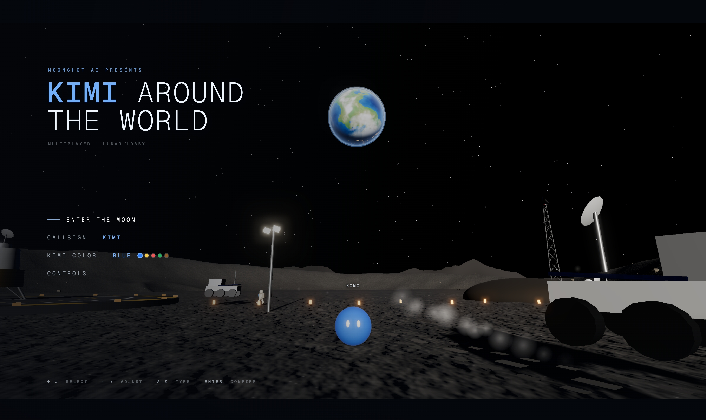
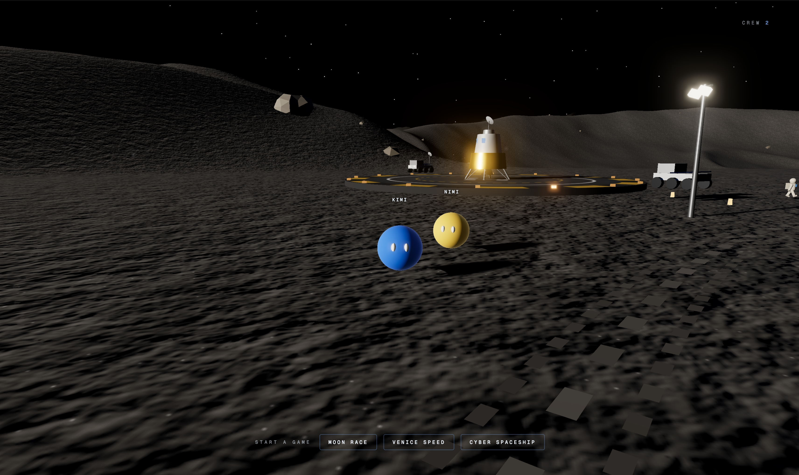
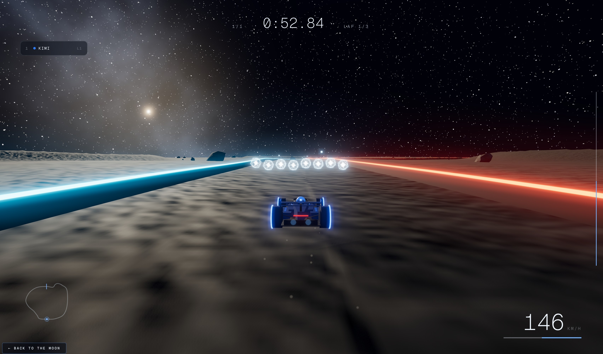
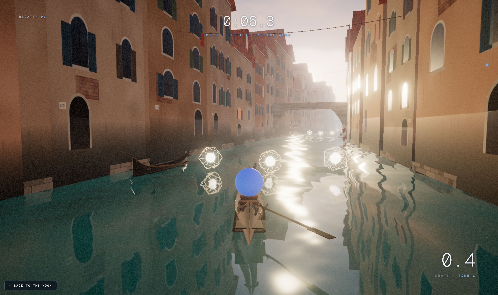
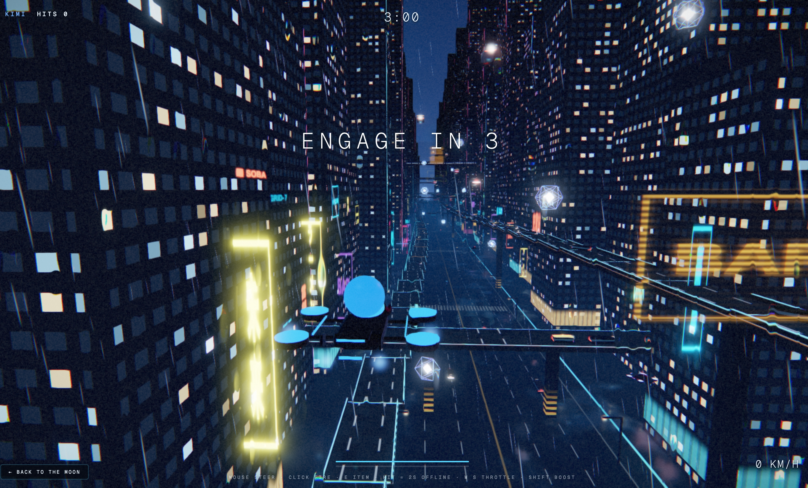

# KIMI AROUND THE WORLD

A browser game made by **Kimi AI** — a real-time 3D lunar base that acts as a
multiplayer lobby, connected to three more Kimi-made 3D games. Everything is
plain web tech (Three.js + WebSocket); no engine, no build step.



You are a Kimi ball on the Moon. From the lobby you can wander the base with
your friends over LAN — or play solo with three NPC Kimi companions — and
launch into three full games together:

**▶ Play it now: <https://512z.github.io/kimi-around-the-world/>** — the
single-player experience (lobby + 3 NPC companions + all three games) is
deployed to GitHub Pages from this repo; LAN multiplayer needs the node
fleet below.

| Game | What it is | Port |
|------|------------|------|
| **MOON RACE** | Lunar grand prix — 3 laps, KartRider-style power-ups | 9101 |
| **VENICE SPEED** | Gondola regatta through dawn canals, item crates | 9102 |
| **CYBER SPACESHIP** | Neon-canyon dogfight, 3-minute HITS deathmatch | 9103 |

The three game ports are **defaults, not requirements** — but they're also
hardcoded in the lobby's launch table (`GAME_TARGETS` in `src/main.js`), so if
you move a game to another port, update that table too. The lobby's own port
is fully free: `PORT=8125 node server.js` works with zero side effects,
because games return via the `back=` URL they're handed.

## Quick start

```bash
npm install
npm run fleet          # lobby :9100 + race :9101 + venice :9102 + city :9103
```

Open `http://localhost:9100` — or share `http://<your-LAN-ip>:9100` and anyone
on the network joins the same moon. Each server can also run alone
(`node server.js`, or `node games/<game>/server.js` with `PORT`).

The same repo deploys to GitHub Pages on every push (Actions workflow in
`.github/workflows/pages.yml`). On any public static host the lobby
automatically links the single-player launcher to the in-repo static copies
of the games (`games/…`) instead of the LAN ports — no config needed.

## Multiplayer



Up to 8 players share the lunar base over LAN: real-time movement, ball-vs-ball
collisions, name tags, crew counter. The first player in is the **host** and
picks a game; after a shared 5-second countdown everyone is redirected into
that game together, carrying their callsign and color. All state is relayed by
the small WebSocket servers in this repo — no external services.

## Single player

Choosing **SINGLE PLAYER** keeps everything local: three NPC Kimi balls spawn
in the base (yellow, red, plus colors that never match yours), idle-hop around
the plaza, follow you when you come close — and when you launch a game, they
come along as your AI opponents: three rival cars in MOON RACE, three AI
gondolas in VENICE SPEED, three AI ships in CYBER SPACESHIP.

## The games

### MOON RACE — Lunar Night Grand Prix



A banked circuit carved into Mare Imbrium, raced at night under a dense star
field. Low-g lunar physics with maglev downforce, a 58°-banked crater bowl,
a rim-crest jump, 8-way LAN races with interpolated remote cars, and
KartRider-style items (banana, homing rocket, shield, turbo). Solo mode races
7 AI drivers; the lobby's solo mode races the 3 NPCs. Details:
[games/race/README.md](games/race/README.md).

### VENICE SPEED — Venice at Dawn



Pole a gondola through misty dawn canals with planar-reflection water. Solo is
a ferry run (kiss the docks, don't drown the fares); multiplayer is a
point-to-point regatta with floating lantern crates (wave, whirlpool, anchor,
splash, shield, swap). The 3 NPCs join as AI gondolas in solo lobby mode.
Details: [games/venice/README.md](games/venice/README.md).

### CYBER SPACESHIP — Neon-Canyon Dogfight



Two games in one cyberpunk city: a solo endless chase through rain and neon
(`index.html`), and an 8-player LAN dogfight (`arena.html`) — plasma bolts,
stun hits, crate items (shockwave, EMP, shield, dash) in a seamlessly looping
canyon. The 3 NPCs join as AI pilots in solo lobby mode. Details:
[games/city/README.md](games/city/README.md).

## Repository layout

```
├── server.js          # lobby: static files + WebSocket relay (default :9100)
├── fleet.mjs          # `npm run fleet` — starts lobby + all 3 games
├── index.html         # lobby front-end (menu / HUD / launcher)
├── src/               # lobby client (menu, player, NPCs, net, terrain, base…)
├── games/
│   ├── race/          # MOON RACE    (:9101) — src/, server.js, README.md
│   ├── venice/        # VENICE SPEED (:9102) — src/, server.js, README.md
│   └── city/          # CYBER SPACESHIP (:9103, arena.html) — js/, server.js, README.md
├── assets/            # kimi_mascot.glb (the hero ball model)
├── images/            # screenshots used in this README
├── prompts/           # the original prompts each part was built from
└── shots/             # Playwright test harnesses + reference screenshots
```

All four servers share the same small relay protocol (join/roster/state/20 Hz
fan-out/raceStart/item) and serve with `Cache-Control: no-store`, so a browser
refresh always picks up the latest code. The lobby detects whether it's
talking to the real game server and silently falls back to solo exploration on
any static host.

## Testing

`shots/` holds the Playwright harnesses used to verify the fleet headlessly —
menu/mode flow, NPC behavior and collisions, solo+multiplayer launches, and
the end-to-end lobby→game handoff (`shots/integration-solo.mjs`,
`shots/solo-test.mjs`, `shots/mp-test.mjs`). Each game also exposes `window.__*`
debug hooks for scripted driving; see the per-game READMEs.

## The making process

Everything you see was prompted into existence, step by step — the original
prompts are kept in [`prompts/`](prompts/):

1. **Model the mascots and ships in Blender.** Kimi used the Blender MCP to
   author the Kimi mascot ball (the player character in every game) and the
   cyberpunk drone ships, exported as GLBs; the race cars are generated
   procedurally in code instead. (Requirements live in
   [prompts/prompt-moon-base.md](prompts/prompt-moon-base.md) and
   [prompts/prompt-cyber.md](prompts/prompt-cyber.md).)
2. **Build the lunar base.** One prompt for the crater-edge research base —
   procedural regolith terrain, the huge Earth over the horizon, habitats,
   rovers, astronauts — and the playable Kimi-ball lobby on top of it:
   [prompts/prompt-moon-base.md](prompts/prompt-moon-base.md).
3. **Build the three game worlds**, each from a single scene prompt turned
   into a full game: the moon circuit
   ([prompts/prompt-moon-race.md](prompts/prompt-moon-race.md)), the dawn
   canals ([prompts/prompt-venice.md](prompts/prompt-venice.md)), and the
   rainy neon canyon
   ([prompts/prompt-cyber.md](prompts/prompt-cyber.md)).
4. **One cinematic front-end everywhere.** The same menu/HUD design system —
   live scene behind the menu, left rail, letterbox, Geist Mono — was applied
   to the lobby and all three games:
   [prompts/prompt-menu-design.md](prompts/prompt-menu-design.md).
5. **Wire it into a fleet.** Follow-up iterations added the WebSocket relays,
   the host-picks-a-game lobby flow with its shared countdown redirect, the
   single-player mode with its three NPC companions, and finally consolidated
   everything into this monorepo.

---

Designed, coded, tested and documented by **Kimi AI** (with a little Blender
for the mascot). Have fun on the Moon. 🌕
